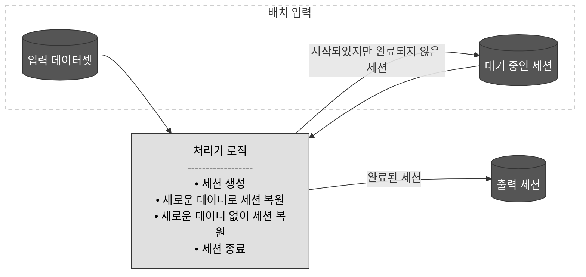

# 5.1 데이터 강화

## 패턴 #23: 정적 조이너

### 5.1.1 문제

- 사용자의 등록 일자와 일상적인 활동 간의 의존성을 이해하기 쉽도록 데이터셋을 생성해 달라는 요청
- 참조 데이터를 사용자 활동에 가져와야 함

### 5.1.2 해결책

정적 조이너 패턴

- 내가 가진 중심 데이터(로그, 주문 내역 등)에 부가적인 정보(회원 정보, 상품 카테고리 등)을 결합하여 데이터를 더 풍부하게 만드는 패턴
- 배치 뿐만 아니라 스트리밍 파이프라인에도 적용 가능
- 두 데이터셋을 결합하는 데 사용할 속성 목록 필요
    - 키 조건 외에 특히 강화 데이터셋이 천천히 변화하는 차원의 형태를 구현할 때는 결합 시 시간 제약 발생 가능
1. 코드 구현 시 강화는 종종 SQL JOIN 문으로 표현되는데 최신의 데이터 처리 프레임워크와 더불어 고전적인 데이터 웨어하우스도 지원하므로 범용적
2. API 활용하여 데이터셋 강화 - HTTP 라이브러리를 사용하여 데이터 처리 계층과 외부 API간의 통신 활성화 
    
    2-1. 데이터가 파이프라인을 흘러갈 때 매번 외부 API를 직접 호출하여 최신 정보를 가져와 결합하는 방식으로 부가정보가 실시간으로 계속 변해서 무조건 가장 최신의 상태를 조회해야 할 때 사용 - 환율 등 
    
    - 실시간 API 강화: API ← 데이터셋 처리 → 처리된 데이터셋을 출력 테이블에 적재
    
    2-2API로는 테이블과 같은 데이터 스토리지 계층에서 데이터셋에 접근 가능하기 때문에 필요하다면 API로 노출된 데이터셋을 전처리 단계에서 테이블로 구체화하여 JOIN문의 일부로 사용 가능 
    
    - API가 제공하는 데이터가 자주 바뀌지 않는 경우 API를 매번 호출하면 비효율적이므로 새벽에 API 데이터를 통째로 긁어와서 DB에 테이블로 저장(구체화, Materialize), 실제 데이터 처리할때는 빠르게 SQL JOIN 사용
    - 구체화된 API 정적 데이터 강화: API ← API 동기화 → DB → 데이터셋 처리 → 처리된 데이터셋을 출력 테이블에 적재

천천히 변화하는 차원

- 시간에 민감한 데이터 강화를 사용해야 한다면 천천히 변화하는 차원 (SCD)의 형태로 구현가능
- 해결책에서 강화 데이터셋은 SCD 유형2나 유형4를 구현해야 함
    - 유형2: 일자로 추적을 관리하고 각각의 현재 값에는 종료 일자가 비어있음
    - 유형4: 두 개의 테이블에 의존하며 첫 번째 테이블은 각 엔티티의 현재 값을 저장하고, 두번째 테이블은 현재 값을 포함한 과거 값을 저장

### 5.1.3 결과

#### 1. 지연 데이터와 일관성

- 이상적인 상황에서는 이벤트가 생성되는 속도와 같은 속도로 사용자가 변화 - 실제와는 다름
- 스트리밍 파이프라인에서 지연 문제 완화할면 동적 조이너 패턴 사용 필요
- 배치 파이프라인에서는 오케스트레이션을 통해 강화 데이터셋이 존재할 때까지 기다림
    - 파일/테이블 존재 여부
    - 데이터 크기 및 용량 기준 트리거
    - 업스트림 태스크 완료(의존성 체인) 트리거

#### 2. 멱등성

- 배치 파이프라인을 백필할 때 멱등성 고려해야 함
- 시간 기반 쿼리를 수행할 수 없다면 조인하기 전에 시간 측면을 제어할 수 있도록 강화 데이터셋을 데이터 계층으로 가져와야함
    - 시간 기반 쿼리를 수행할 수 없다 = 오직 “현재 상태”만 제공 가능
    - 이 상태에서 과거 데이터를 백필하면 과거 로그에 현재의 부가 정보가 결합되어 데이터 일관성이 꺠지고 멱등성이 무너짐
    - 외부 데이터를 스냅샷 저장 등의 형태로 데이터 계층으로 가져와서 과거의 특정 시점 데이터를 직접 제어할 수 있도록 만들어야 함

### 5.1.4 예제

- SCD 유형2 예제

```sql
# 테이블 1
CREATE TABLE dedp.users ( # ...
    id TEXT NOT NULL,
    login VARCHAR(45) NOT NULL,
    start_date TIMESTAMP NOT NULL DEFAULT NOW(),
    end_date TIMESTAMP NOT NULL DEFAULT '9999-12-31'::timestamp
    PRIMARY KEY(id, start_date)
);

# 테이블 2
CREATE TABLE dedp.visits ( # ...
    visit_id CHAR(36) NOT NULL,
    event_time TIMESTAMP NOT NULL,
    PRIMARY KEY(visit_id, event_time)
);

# 유형2 조인 예제
SELECT v.visit_id, v.event_time, v.page, u.id, u.login, u.email
FROM dedp.visits v JOIN dedp.users u ON u.id = v.user_id
    AND NOW() BETWEEN start_date AND end_date;

```

- 데이터셋의 현재 상태를 얻기 위해 NOW() 사용
- 데이터 오케스트레이터가 젝ㅇ하는 실행 시간 사용 가능 - 파이프라인 실행과 관련된 불변의 속성으로 멱등성을 강제하는데 도움

- 배치 데이터셋과 스트리밍 데이터셋 조인

```python
devices: DataFrame = spark.read.format('delta').load(...)
visits: DataFrame = (spark.readStream.format('kafka').load()...

(visits.join(devices_table, [visits.device_type == devices.type,
    visits.device_version == devices.version], 'left_outer'))
```

- 정적 데이터셋과 스트리밍 잡은 수명 주기가 다르기 때문에 조인 실패나 전체 다시 쓰는 경우 빈 참조 테이블과 조인할 수 있음
- JSON, CSV 같은 원시 형식을 사용하는 경우 발생할 수 있지만 원자성과 일관성 보장을 제공하는 테이블 파일 형식에 의존한다면 방지 가능

- 원시 데이터셋을 API를 통해 노출된 데이터셋과 결합

```python
class KafkaWriterWithEnricher:
    BUFFER_THRESHOLD = 100
    # ...
    def process(self, row):
        if len(self.buffered_to_enrich) == self.BUFFER_THRESHOLD:
            self._enrich_ips()
            self._flush_records()
        else:
            self.buffered_to_enrich.append(row)

    def _enrich_ips(self):
        ips = (','.join(set(visit.ip for visit in self.buffered_to_enrich)))
        if visit.ip not in self.enriched_ips)))
        fetched_ips = requests.get(f'http://localhost:8080/geolocation/fetch?ips={ips}',
            headers={'Content-Type': 'application/json', 'Charset': 'UTF-8'})
        if fetched_ips.status_code == 200:
            mapped_ips = json.loads(fetched_ips.content)['mapped']
            self.enriched_ips.update(mapped_ips)
```

- 대량 작업의 활용 권장 - 네트워크 처리량 최적화 가능

## 패턴 #24: 동적 조이너

### 5.1.5 문제

- 각 사용자 변경 사항이 변경 데이터 캡처(CDC) 패턴에서 스트리밍 브로커에 등록 - 데이터셋이 둘 다 동적 상태

### 5.1.6 해결책

- 정적 조이너 패턴과 키의 식별, 조인 메소드의 정의를 한다는 것은 같지만 “시간 경계”에 대한 설정이 추가로 필요
    - 전용 시간 관리 전략이 없으면 두 데이터셋의 지연 시간이 서로 다르기 때문에 많은 조인이 빈 값일 위험이 있음
1. 시간 조건 정의
    - 양족 스트림에서 조인된 레코드의 버퍼에 시간 경계가 설정되면서 빠른 데이터 원천이 느린 데이터 원천과 시간적인 시맨틱을 맞출 수 있음
2. GC 워터마크 
    - 두 스트림의 이벤트를 보관하는 대신 오래된 이벤트가 각 버퍼에서 언제 사라져야 하는지를 정의
    - 레코드 하나가 매우 늦게 도착하면 조인을 잃을 수 있지만 버퍼를 관리 가능한 크기로 유지하기 위한 트레이드오프

### 5.1.7 결과

#### 1. 공간 vs 정확성 트레이드오프

- 버퍼 공간을 늘리면 효율성을 최적화할 수 있지만 자원 비용 발생
- 공간을 줄이면 스토리지 최적화도지만 지연 차이가 클 경우 일치 가능성이 낮아짐

#### 2. 지연 데이터

- 스트림 처리는 본질적으로 낮은 지연 처리 시맨틱으로 인해 파이프라인에서 지연 데이터 통합에 대한 내결함성이 약함
- 이 제한을 극복하려면 지연 데이터를 추적하고 통합해야 함

### 5.1.8 예제

# 5.2 데이터 데코레이션

## 패턴 #25: 래퍼

- 래핑은 소프트웨어 공학에서 객체에 별도의 동작이나 속성을 추가한다는 의미

### 5.2.1 문제

- 출력 스키마가 다른 다양한 데이터 수집 상황
- 다양한 필드를 추출하여 단일 위치에 넣는 잡을 작성하고 이를 통해 다운스트림 컨슈머가 쉽게 처리할 수 있게 해야함
- 처리 로직을 단순화하기 위해 계산된 값을 원래 값과 명확히 분리하되 디버깅 요구를 위해 원래 구조 유지 필요
- 문제 상황 예시

```html
웹 로그: {"user_id": 123, "ip": "1.1.1.1", "device": "PC"}

앱 로그: {"uid": 123, "ip_address": "1.1.1.1", "os": "iOS"}

오프라인 매장 태블릿 로그: {"cust_no": 123, "wifi_ip": "1.1.1.1", "store_id": "Gangnam"}
```

- 필드 이름이 (`user_id`, `uid`, `cust_no`)로 전부 다름
- 다운스트림(데이터 분석가나 다른 시스템)에서 쓰기 편하게 하려면 이를 **하나의 표준 테이블**로 합쳐야 하고, 분석을 편하게 하기 위해 IP 주소를 기반으로 대략적인 `국가(Country)` 정보도 미리 계산해서 넣어주고 싶음
- 고려 사항
1. 서로 다른 스키마를 어떻게 하나의 테이블에 집어넣을 것인가?
2. 나중에 IP 변환 로직이 잘못되었을 때 디버깅을 하려면 원본 IP 필드가 그대로 살아있어야 하는데, 형태가 다 다른 원본을 어떻게 유지할 것인가?

### 5.2.2 해결책

- 레코드 수준에 또 다른 추상화 추가: 예를 들어, 입력 방문 이벤트는 두 개의 절에 각각 해당하는 원시필드와 계산된 필드로 구성된 이벤트로 변환 가능
- 아파치 아브로, protobuf, JSON등의 형식 외에 테이블 같은 구조화된 형식에서도 지원
- 이러한 컨텍스트에서 필요한 경우 원본 테이블과 조인할 수 있는 별도의 테이블로 구현하거나 동일한 테이블 내의 추가 컬럼으로 구현 할 수 있음
    - 동일한 테이블 내 추가 컬럼(nested 구조 또는 접두사 활용)
    
    | **computed (STRUCT 타입)** | **raw (JSON/VARIANT 타입)** |
    | --- | --- |
    | `{"standard_user_id": "123", "country": "KR"}` | `{"user_id": 123, "ip": "1.1.1.1", "device": "PC"}` |
    | `{"standard_user_id": "123", "country": "KR"}` | `{"uid": 123, "ip_address": "1.1.1.1", "os": "iOS"}` |
    - 별도의 테이블로 구현(1:1 조인 관계)
    
    ```html
    # 두 테이블은 event_id로 묶여 있어 필요할 때만 SQL JOIN 문으로 디버깅
    standard_events 테이블: 공통적이고 계산된 값들만 명확한 스키마로 저장 
    (event_id, standard_user_id, country)
    
    raw_events 테이블: 각 소스별 원본 데이터를 통째로 문자열이나 텍스트로 저장 
    (event_id, raw_text_data)
    ```
    

예시 

1. 원래 레코드를 평면 구조로 저장하고 계산된 컬럼은 중첩된 속성으로 저장

| **user_id (원래)** | **ip (원래)** | **computed (중첩 컬럼)** |
| --- | --- | --- |
| 123 | 1.1.1.1 | `{"country": "KR"}` |
1. 계산된 레코드를 단일 평면 구조로 저장

| **country (계산됨)** | **raw (중첩 컬럼)** |
| --- | --- |
| KR | `{"user_id": 123, "ip": "1.1.1.1"}` |
1. 모든 컬럼을 동일한 수준의 평면 구조로 저장

| **user_id** | **ip** | **country** |
| --- | --- | --- |
| 123 | 1.1.1.1 | KR |
1. 데이터를 나중에 고유 키로 조인할 수 있는 두 개의 별개 테이블에 저장
- 1,2번 방식은 조회 시 더 빠른 비정규화 접근 방식 사용
- 정규화된 접근 방식을 사용한 3번은 조회가 느릴 수 있지만 데이터셋을 논리적으로 독립시켜야 하거나 기존 구조를 변경할 수 없을 때 더 나은 선택지 일 수 있음

### 5.2.3 결과

#### 1. 도메인 분할

- 이 패턴이 주어진 도메인의 속성을 분리하기 때문에 도메인 분할은 자연스러운 논리적 결과
- 변환된 값과 변환되지 않은 값을 명확히 구분하기 때문에 데이터 조회가 더 복잡해지며, 컨슈머는 사용자 데이터가 두 위치에 나뉘어 있다는 점을 인지해야 함

#### 2. 크기

- decorated 값은 처리된 레코드의 본질적인 부분을 형성하므로 전체 크기와 네트워크 트래픽에 영향을 미침
- 데이터 스토리지 형식이 데이터 원천 프로젝션을 지원한다면 제한 사항 완화 가능 - 해당 기능을 통해 관심있는 컬럼을 선택하고 데이터 원천에 해당 컬럼만 물리적으로 접근하도록 요청 가능 (AWS Redshift, GCP BigQuery)

### 5.2.4 예제

```python
# 파이스파크롤 메타데이터 랩핑하기
visits_w_processing_context = (visits.withColumn('processing_context', F.struct(
    F.lit(job_version).alias('job_version'), F.lit(batch_number).alias('batch_version')
)))

visits_to_save = (visits_w_processing_context.withColumn('value', F.to_json(
    F.struct(F.col('value').cast('string').alias('raw_data'),
    F.col('processing_context')))))

# SQL에서 추가적인 구조체로 랩피하기
SELECT *, NAMED_STRUCT(
    'is_connected',
    CASE WHEN context.user.connected_since IS NULL
         THEN false ELSE true END,
    'page_referral_key', CONCAT_WS('-', page, context.referral)
) AS decorated FROM input_visits

# SQL에서 원시 값 구조체로 랩핑하기 
SELECT
    CASE WHEN context.user.connected_since IS NULL
         THEN false ELSE true END AS is_connected,
    CONCAT_WS('-', page, context.referral) AS page_referral_key,
    STRUCT(visit_id, event_time, user_id, page, context) AS raw
FROM input_visits

```

## 패턴 #26: 메타데이터 데코레이터

### 5.2.5 문제

- 유지보수를 단순화하려면 생성된 각 레코드에 잡 버전 같은 기술적 컨텍스트를 추가해야 함
- 하지만 이 정보를 최종 사용자에게 보내는 레코드에는 포함하고 싶지 않음

### 5.2.6 해결책

데이터 스토어의 메타데이터 계층을 활용하여 메타데이터 데코레이터 패턴 적용

래퍼와 메타데이터  시맨틱의 차이점: 메타데이터의 노출 여부 

- 메타데이터 지원:
    - 작성된 각 레코드를 전용 메타데이터 속성과 연결 가능(키-값)
    - 객체 스토어를 사용할 때 주어진 파일의 모든 레코드에 적용된다면 메타데이터 속성을 해당 파일과 관련된 태그로 정의 가능
- 메타데이터 미지원:
    - RDBMS, NoSQL 등
    - 메타데이터를 데이터 부분에 포함시켜 데코레이션 효과를 시뮬레이션 할 수 있음
    - 각 레코드의 메타데이터를 개별적으로 추적하고 싶다면 이를 전용 컬럼에 쓰고 이 기술적 정보가 없는 뷰에서 테이블을 노출하거나 해당 컬럼을 조회하지 못하도록 권한 사용 가능
- 처리 컨텍스트를 데이터셋과 조인할 전용 테이블에 저장 가능 → 스키마에 이 테이블을 숨기는 방법이라 훨씬 간단

### 5.2.7 결과

#### 1. 구현

- 스트리밍 브로커도 네이티브 메타데이터 지원이 부족하여 구현 불가능할 수 있음 - 키네시스
- 테이블 데이터셋에서의 구현도 메타데이터 정보를 처리하기 위해 추가 컬럼이나 테이블을 정의해야 하는 등 더 많은 노력 필요

#### 2. 데이터

- 메타데이터에 배송주소나 송장 금액같은 비즈니스 관련 속성을 작성하지 않아야 함 - 컨슈머는 메타데이터 부분을 쿼리하지 않기 때문

### 5.2.8 예제

```sql
# 파이스파크에서 아파치 카프카에 메타데이터 헤더 추가
visits_with_metadata = (visits_to_save.withColumn('headers', F.array(
    F.struct(F.lit('job_version').alias('key'), F.lit(job_version).alias('value')),
    F.struct(F.lit('batch_version').alias('key'),
    F.lit(str(batch_number).encode('UTF-8')).alias('value'))
)))
(visits_with_metadata.write.format('kafka')
    .option('kafka.bootstrap.servers', 'localhost:9094')
    .option('includeHeaders', True).option('topic', 'visits-decorated')
    .save())

# 메타데이터 테이블 초기화 
CREATE TABLE dedp.visits_context (
    execution_date_time TIMESTAMPTZ NOT NULL,
    loading_time TIMESTAMPTZ NOT NULL,
    code_version VARCHAR(15) NOT NULL,
    loading_attempt SMALLINT NOT NULL,
    PRIMARY KEY (execution_date_time)
)

# 메타데이터 테이블로 새로운 visits 삽입

INSERT INTO dedp.visits_context
    (execution_date_time, loading_time, code_version, loading_attempt)
VALUES ('{{ execution_date }}', '{{ dag_run.start_date }}',
    '{{ params.code_version }}', {{ task_instance.try_number }});

INSERT INTO {{ weekly_table }} (SELECT tmp_devices.*,
    '{{ execution_date }}' AS visits_context_execution_date_time FROM tmp_devices);
```

# 5.3 데이터 집계

## 패턴 #27: 분산 집계기

분산 데이터 처리 프레임워크를 활용 - 물리적으로는 독립되지만 논리적으로는 유사한 항목을 결합하는 특징을 가짐

### 5.3.1 문제

- 브론즈 계층에서 원시 방문 이벤트 정리 후 실버 계층에 쓰는 잡 작성
- 온라인 분석 처리(OLAP) 큐브를 규축하여 모든 방문 데이터를 대시보드 시나리오에 잘 맞는 집계 형식으로 변환 필요
- 데이터셋은 일별 이벤트 시간 파티션에 저장되고 분석 큐브는 일별 및 주간 뷰를 표현해야 함

### 5.3.2 해결책

빅데이터 시대에는 관련 레코드가 여러 물리적 장소에 분산될 수 있음 → 분산 집계기 패턴이 도움

- 클러스터 사용
    - 서버들은 개별적으로 전체 입력 데이터셋을 처리할 용량이 충분하지 않지만 작업을 나눠서 처리하기 때문에 전체 입력 데이터셋 처리 가능
    - 코드 기반 구현은 그룹핑 함수를 사용하여 관련 코드들을 모으고 나중에 그 위에 축소 함수를 적용하는 등 소규머 로컬 데이터셋과 동일하게 유지될 수 있음
    - 전체 데이터셋을 그대로 결합할 수도 있음 - 전체 레코드 수를 구하거나 모든 레코드에 걸쳐 전역 평균을 구하는 경우
- 주의점:
    - 셔플: 서로 다른 장비에 처음 적재된 레코드를 네트워크를 통해 교환하는 단계
    - 모든 레코드 교환이 원시 형태로 이루어지는 것은 아니며 부분 생성을 지원하는 모든 집계는 셔플 전에 로컬에서 부분 집계를 수행하여 최적화 가능 → 계수 연산 사용

### 5.3.3 결과

#### 1. 추가적인 네트워크 교환

- 셔플이 두 번 발생:
    - 입력 데이터를 각 노드에 전달
    - 분산 집계기 패턴에서 수행 - 지연 문제 야기하지만 특정 조건에서는 해당 셔플을 피할 수 있음(로컬 집계기 패턴)

#### 2. 데이터 스큐

- 데이터 스큐: 특정 키가 다른 키들보다 발생 빈도가 훨씬 큰 불균형 데이터셋

스큐를 방지하는 방법

- 솔팅: 그룹핑 키에 추가 값을 더하고 솔트가 추가된 컬럼에서 첫 번째 그룹핑 연산을 수행하는 방식
    - 원래 그룹핑 키의 결과를 얻고 싶다면 솔트가 추가된 컬럼의 집계 결과 재집계 필요
- AQE(Adaptive Query Execution)

#### 3. 확장

- 노드가 계획된 모든 리듀스 작업을 완료해도 내결함성을 이유로 하드웨어 계층에서 여전히 사용 가능
- 연산 실패로 재시작 시 해당 데이터는 다시 셔플할 필요가 없지만 실패가 없다면 해당 노드는 계속 존재, 처리 작업이 실행중인 한 회수되지 않음
- 셔플서비스를 통해 해당 문제 해결 가능
    - 셔플 서비스: 오직 셔플 데이터를 저장하고 서빙하는 추가 컴퓨팅 구성 요소
    - 노드를 더 이상 사용하지 않으면 잡이 아직 실행 중일 때도 컴퓨팅 계층이 언제든지 노드 해제 가능
    - 아파치 스파크의 External Shuffle Servie
    - GCP 데이터 플로의 Shuffle

### 5.3.4 예제

```sql
# 스큐가 발생한 컬럼 column_a에 대한 파이스파크의 솔팅
dataset.withColumn('salt', (rand()*3).cast("int"))
    .groupBy('group_key', 'salt').agg(...)
    .groupBy('group_key').agg(...)

# 파이스파크에서 물리적으로 독립된 두 데이터 스토어의 집계
visits: DataFrame = spark_session.read.json(f'{base_dir}/input-visits')
devices: DataFrame = spark_session.read.jdbc(url='jdbc:postgresql:dedp',
    table='dedp.devices', properties={'user': 'dedp_test',
    'password': 'dedp_test', 'driver': 'org.postgresql.Driver'})
visits_with_devices = visits.join(devices,
    [devices.type == visits.context.technical.dev_type,
     devices.version == visits.context.technical.dev_version],
    'inner')
```

- 셔플이 포함되었는지 확인하는 방법 - explain() 사용 후 Exchange hashpartitioning 노드 확인
- 해당 패턴은 서로 다른 스토리지 위치에서 데이터셋을 조회할 수 잇는 데이터베이스에 적용 가능
    - 외부 테이블(external table)로 선언하고 쿼리에서 일반적인 객체처럼 참고하여 사용 - GCP의 GCS, AWS 레드시프트, 애저 시냅스 애널리틱스, 스노우플레이크 등

## 패턴 #28: 로컬 집계기

### 5.3.5 문제

- 스트리밍 잡은 파티셔닝된 스트리밍 브로커에 저장된 방문의 윈도를 생성
- 데이터 양이 정적, 기본적인 파티션에 갑작스러운 변형이나 변화 예상 되지 않음 → 파티션 수 변경 없음
- 잡 최적화 , 데이터 처리 프레임워크에 의해 자동으로 추가되는 그룹핑 셔플 단계 제거 필요

### 5.3.6 해결책

- 로컬 집계기 패턴은 비용이 많이 드는 셔플, 정적 데이터 원천 파티셔닝, 관련 속성의 공동 저장에 용이
- 장점
    - 일부 집계를 여전히 수행하지만 그 집계를 입력 데이터를 조회하는 단일 네트워크 교환으로 로컬에서 수행
    - 태스크가 완전히 독립적: 다른 태스크의 데이터를 기다릴 필요 없이 바로 진행 가능
- 구현은 프로듀서 측에서 중점
    - 특정 그룹핑 키를 가진 레코드가 동일한 물리적 파티션에 기록되도록 보장 필요
    - 정적 레코드별 파티션 키와 불변의 파티션 수를 통해 달성 가능
- 카프카 스트림의 groupByKey
- 아파치 스파크의 mapPartitions, foreachPartition
    - 그 외에도 동일한 키와 동일한 수의 버킷에 저장된 데이터셋에 대해서는 셔플을 피하는 기능이 있음

— 버킷: 버킷팅(클러스터링)은 파티션을 분할하는 방법

### 5.3.7 결과

#### 1. 확장

- 데이터 원천의 정적인 본질과 일관된 파티셔닝에 의존 - 주어진 키가 항상 하나의 처리 파티션에만 가용성 보장
- 조직 확장 및 조정 시 - 전용 데이터 스토리지 재구성 작업을 통해 모든 레코드의 파티션 할당을 새로 생성해야해서 비용이 많이 들 수 있음
    - 스트리밍에 적용하기는 좀 더 어려움 → 운영환경에서 데이터 프로듀서가 새롭게 구성된 파티션에 레코드를 작성하기 전에 이전 파티션의 모든 잔여 데이터를 처리하기 위해 모든 것을 중단하는 이벤트(stop-the-world)가 필요하기 때문

#### 2. 그룹핑 키

- 해당 패턴은 파티션 수가 정적인 파티션된 데이터 원천에서 모든 컨슈머가 공통의 그룹핑 키 로직을 사용하길 기대 → 실제로는 동일한 레코드를 여러 장소에 각각 다른 그룹핑 키로 작성
- 예를 들어, A는 변경 유형별로 그룹화 B는 사용자ID 기반 집계

### 5.3.8 예제

```sql
# 카프카 스트림에서의 로컬 집계
KStream<String, String> visitsSource = streamsBuilder.stream("visits");
KGroupedStream<String, String> groupedVisits = visitsSource.groupByKey();
KStream<String, AggregatedVisits> aggregatedVisits = groupedVisits
    .aggregate(AggregatedVisits::new, new AggregatedVisitsAggregator(),
        Materialized.with(Serdes.String(), new JsonSerializer<>())).toStream();
aggregatedVisits.to("visits-aggregated", Produced.with(new Serdes.StringSerde(),
    new JsonSerializer<>()));

# 파이스파크에서 방문을 위한 로컬 집계 
sorted_visits: DataFrame = (visits_to_save
    .sortWithinPartitions(['visit_id', 'event_time']))
def write_records_from_spark_partition_to_kafka_topic(visits):
    kafka_writer = KafkaWriter(...)
    for visit in visits:
        kafka_writer.process(visit)
    kafka_writer.close()

sorted_visits.foreachPartition(write_records_from_spark_partition_to_kafka_topic)

# 파이스파크에서 방문을 위한 로컬 집계기: 파티션 기반 작성자
class KafkaWriter:
    def __init__(self, bootstrap_server: str, output_topic: str):
        self.in_flight_visit = {'visit_id': None}

    def process(self, row):
        if row.visit_id != self.in_flight_visit['visit_id']:
            send_visit_to_kafka(self.in_flight_visit)
            self.in_flight_visit = {'visit_id': row.visit_id, 'pages': [],...}

        self.in_flight_visit['pages'].append(row.page)
    # ...

```

# 5.4 세션화

## 패턴 #29: 증분 세션화 처리기

### 5.4.1 문제

- 세션시간 두시간
- 방문 세션의 일반적인 지속 시간은 몇분 ~ 세시간이라고 할때 한번의 방문은 최대 세개의 다른 파티션에 걸쳐 확산

### 5.4.2 해결책

아래 세가지로 스토리지 공간 분리 필요

- 입력 데이터셋 스토리지 - 원시 이벤트 저장
- 완료된 세션 스토리지
    - 완료된 세션 기록, 진행 중인 세션도 기록될 수 있지만 이상적으로는 완료된 세션과 구별되어야 함(is_final = false 등으로 구분 가능)
- 대기 중인 세션 스토리지
    - 실행 중 하나에서 닫히게 될 여러 파티션에 걸쳐 있는 세션 모두 저장
    - 완료된 세션 스토리지와의 차이는 개발자 전용공간, 세션의 데이터 형식이 완료된 세션 스토리지의 형식과 다를 수 있음
    - 처리 로직을 정의할 때 멱등성 보장 등을 이유로 실행 ID와 같은 기술 세부 사항이나 내부 세부 사항을 포함할 수 있음

워크플로 로직

- 진행 중인 세션이 없는 특정 엔티티를 위해 생성되는 신규 세션
- 조회 입력에서 새 데이터가 오는 복원된 세션
- 새로운 세션 데이터가 없는 복원된 세션 - 해당 세션은 정의한 만료 규칙에 따라 이번 실행 또는 다음 실행에서 세션이 만료될 가능성이 높음

위의 조합을 완료하면 처리할 세션 데이터를 얻게 되는데 이는 이전 레코드와 새 레코드로 구성될 수 있으며 세 가지 상태를 정의하는 세션화 로직을 적용해야 함

- 초기화: 세션 시작
- 축적: 세션이 활성 상태일 때 - 방문한 페이지를 순서대로 스토리지에 저장하는 방법 등
- 완료: 세션 중지



### 5.4.3 결과

#### 1. 비활성 기간

- 비활성 기간은 세션을 얼마나 오래 열어둘 수 있을지를 정의하는데 길어질수록 세션에 더 오래된 지연 데이터를 포함할 수 있는 반면 더 많은 컴퓨팅 자원과 스토리지 자원이 필요
- 세션이 완전히 끝나지 않았더라도 중간 결과를 부분 세션 뷰로 내보낼 수 있는데 나중에 데이터가 바뀌면 컨슈머가 혼란스러울 수 있으므로 플래그(is_completed: false)를 사용 권장

#### 2. 데이터 최신성

- 배치 파이프라인에서 동작하는 경우가 많기 때문에 인사이트가 실시간에 비해 매우 늦게 도출

#### 3. 지연 데이터, 이벤트 시간 파티션, 백필링

- 세션화 로직이 이벤트 기간 파티셔닝에 의존한다면, 이미 처리된 파티션에 대한 세션을 놓칠 수 있어 지연 데이터가 문제
- 의존성이 있는 경우 백필링 시, 하나의 파티션에 대해 세션 생성 로직을 다시 실행하면 이후 모든 파티션에 대해서도 동일 작업을 해줘야 함 → 비용 부담 증가
- 전용 백필 파이프라인에서 엔티티를 찾아 백필하고 그것들만 다시 실행하는 방법은 비용 최적화, 복잡성 증가라는 트레이드 오프

### 5.4.4 예제

```sql
# 증분 세션화 처리기를 위한 멱등성 컴포넌트
DELETE FROM dedp.sessions WHERE execution_time_id >= '{{ ds }}';
DELETE FROM dedp.pending_sessions WHERE execution_time_id >= '{{ ds }}';

# 세션 생성: 새로운 데이터 적재
CREATE TEMPORARY TABLE visits_{{ ds_nodash }} (# ...);

COPY visits_{{ ds_nodash }} FROM '/data_to_load/date={{ ds_nodash }}/dataset.csv' CSV

# 새션 생성: 로직
CREATE TEMPORARY TABLE sessions_to_classify AS
    SELECT
        SELECT
            COALESCE(p.session_id, n.session_id) AS session_id,
            # ...
            LEAST(p.start_time, n.start_time) AS start_time,
            GREATEST(p.last_visit_time, n.start_time) AS last_visit_time,
            ARRAY_CAT(p.pages, n.pages) AS pages,
            CASE
                WHEN n.user_id IS NULL THEN p.expiration_batch_id
                ELSE '{{ macros.ds_add(ds, 2) }}'
            END AS expiration_batch_id
        FROM (SELECT ... FROM visits_{{ ds_nodash }} )
        WINDOW visits_window AS (PARTITION BY visit_id, user_id ORDER BY event_time)
    ) AS n
    FULL OUTER JOIN (
        SELECT ... FROM dedp.pending_sessions WHERE execution_time_id = '{{ prev_ds }}'
    ) AS p ON n.session_id = p.session_id;

# 세션 생성: 쓰기 컴포넌트 
INSERT INTO dedp.pending_sessions (...)
    SELECT ... FROM sessions_to_classify WHERE expiration_batch_id != '{{ ds }}';
INSERT INTO dedp.sessions (...)
    SELECT ... FROM sessions_to_classify WHERE expiration_batch_id = '{{ ds }}';

```
